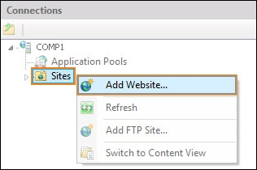
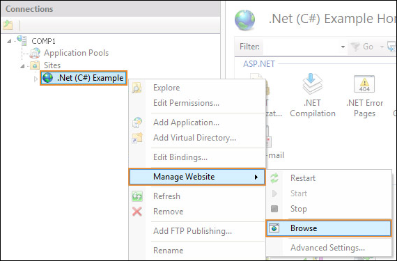

## Overview

This example will help you integrate ONLYOFFICE Docs into your web application written in .Net (C# MVC).

It is aimed at testing the editors. Please, do not use it for production without proper modifications. 

## Step 1. Install ONLYOFFICE Docs

Download and install ONLYOFFICE Docs (packaged as Document Server). 

See the detailed guide to learn how to install Document Server [for Windows](https://helpcenter.onlyoffice.com/installation/docs-developer-install-windows.aspx), [for Linux](https://helpcenter.onlyoffice.com/installation/docs-developer-install-ubuntu.aspx), or [for Docker](https://helpcenter.onlyoffice.com/server/developer-edition/docker/docker-installation.aspx).

## Step 2. Download the .Net (C# MVC) code for the editors integration

Download the [.Net (C# MVC) example](https://api.onlyoffice.com/editors/demopreview) from our site.
You need to connnect the editors to your website. Specify path to the editors installation in the *settings.config* file:
```
<add key="storage-path" value=""/>
<add key="files.docservice.url.site" value="https://documentserver/" />
```
where the **documentserver** is the name of the server with the ONLYOFFICE Document Server installed. Where **storage_path** is the path where files will created and stored, you can set an absolute path.

If you want to experiment with the editor configuration, modify the [parameters](https://api.onlyoffice.com/editors/advanced) in the *DocEditor.aspx* file.

## Step 3. Install the prerequisites
Сheck if your system meets the system requirements:
* **Microsoft .NET Framework**: version 4.5 (download it from the [official Microsoft website](https://www.microsoft.com/en-US/download/details.aspx?id=30653));
* **Internet Information Services**: version 7 or later.

Configure the IIS components for the server to work correctly:
1.	Open Windows features:

	**Start** -> **Control Panel** -> **Programs** -> **Programs and Features** -> **Turn Windows features on or off**

2. In the opened window, find **Internet Information Services** and choose all the necessary features. To do this, open the **World Wide Web Services** list and check the following components:
* **Application Development Features**: .NET Extensibility 4.8, ASP.NET 4.8, ISAPI Extensions, ISAPI Filters,
* **Common HTTP Features**: Default Document,
* **Security**: Request Filtering.

## Step 4. Run your website with the editors
1. Run the Internet Information Service (IIS) Manager:

	**Start** -> **Control Panel** -> **System and Security** -> **Administrative Tools** -> **Internet Information Services (IIS) Manager**
2. Add your website in the IIS Manager.
	
	On the **Connections** panel right-click the **Sites** node in the tree, then click **Add Website**.

	
3. In the **Add Website** dialog box specify the name of the folder with the .Net (C# MVC) project in the **Site name** box.
	
	Specify the path to the folder with your project in the **Physical Path** box.
	
	Specify the unique value used only for this website in the **Port** box.
	
	
4. Check for the .NET platform version specified in IIS Manager for you website. Choose **v4.0.** version.
	
	**Application Pools** -> right-click the platform name -> **Set application Pool defaults** -> **.NET CLR version**
	
	
5. Browse your website with the IIS Manager:

	Right-click the site -> **Manage Website** -> **Browse**
	
	

## Step 5. Check accessibility

In case the example and Document Server are installed on different computers, make sure that your server with the example installed has access to the Document Server with the address which you specify instead of **documentserver** in the configuration files. 

Make sure that the Document Server has access to the server with the example installed with the address which you specify instead of **example.com** in the configuration files.
